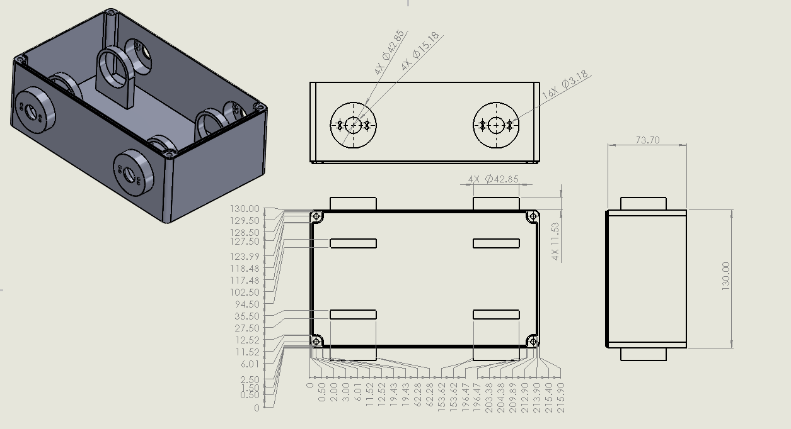
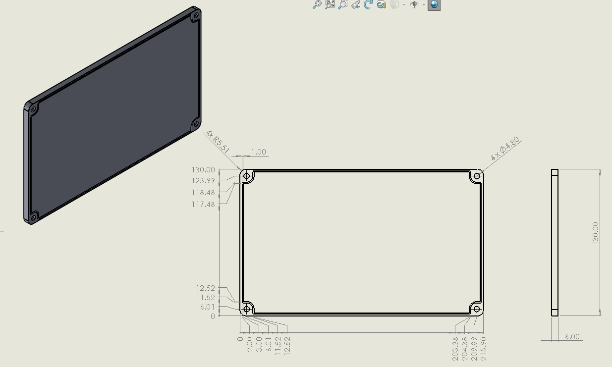
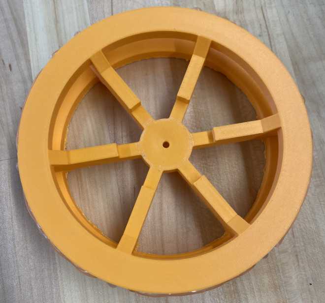
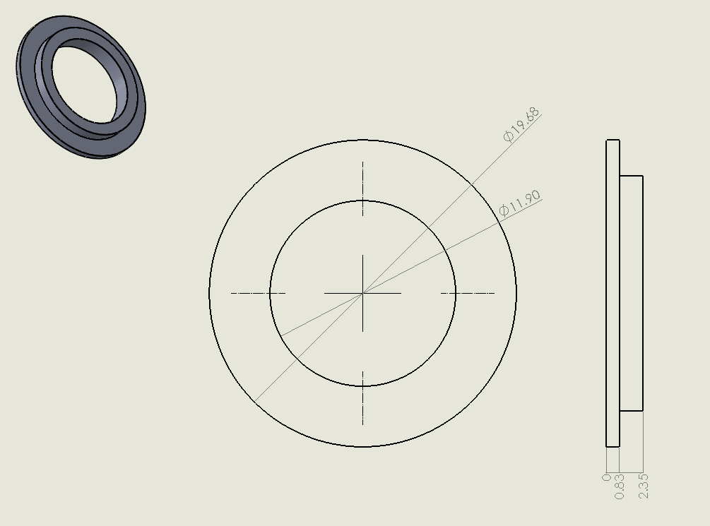
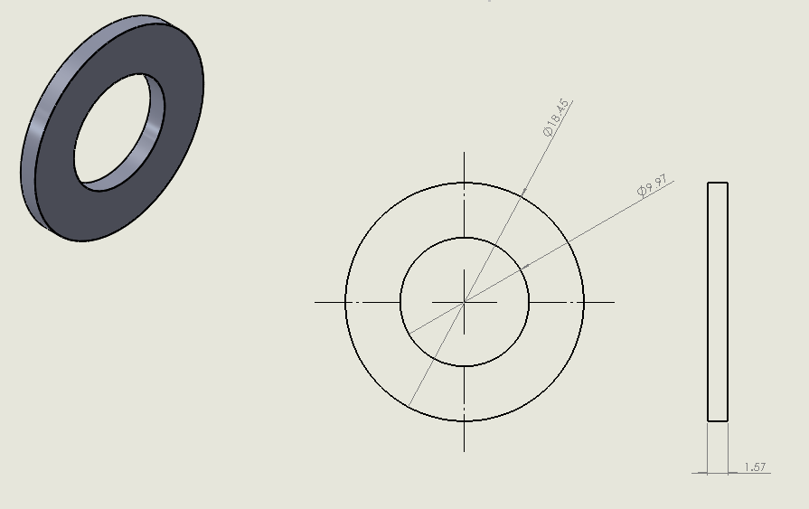
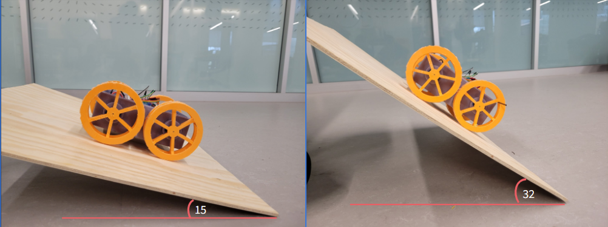

# 3D-Printed-Amphibious-Robot
The goal of this project was to address time sensitive events inaccessible to human responders similar to that of the Thailand Tham Luang cave Incident where a soccer team of 12 children, aged 11-16, were trapped for 17 days. Due to the complexity of the cave system, it took human responders 9 days to prepare and locate the boys and an additional 8 to get them all out to safety.

 

If there was a versatile robot that could crawl, climb, swim, and be quickly manufactured and deployed into diverse and complex environments, the Thailand Tham Luang cave rescue timeline could have been significantly reduced. 

Therefore, for our project, we aimed to design a multi-material, amphibious, robot capable of swimming and traversing uneven terrain using various 3D-printing techniques such as Fused Deposition Modeling (FDM), Pellet Printing, and Stereolithography (SLA). 

 

CAD Model Closed

 

CAD Model Opened

 
 
## Fabrication Techniques Used
* Fused Deposition Modeling (FDM)
* Stereolithography (SLA)
* Pellet Printing (optional)

## Bill of Material:
* Electronics (Note: Reevaluation of Electronics Recommended)
  * Raspberry Pi Pico H (x1)
  * L298N Motor Controller (x2)
  * Buck Converter (x1)
  * 35T Motors (x4)

* Printing Materials
  * ELEGOO ABS-Like Photopolymer Resin 
  * NinjaTek Chinchilla TPU
  * Standard Polylactic Acid (PLA) filament
  * 30A Pellets (optional)

## Fabrication of Chassis and Lid
* Chassis and Lid were SLA printed with ELEGOO ABS-Like Photopolymer Resin. This was due to the need for the body of the robot to be waterproof as resin is known to make great water-tight components. 

Chassis Drawing

 

Lid Drawing

 

## Fabrication of Wheels
* Wheels were fabricated FDM using standard PLA. This was chosen to save weight as the wheels did not need to be water-tight. 

 

Wheel Drawing

 

## Fabrication of Motor Seals and Washers
* The motor seals and washers were printed out of NinjaTek Chinchilla TPU. These components were designed to mimic rubber water seals and o-rings which the TPU material does nicely. However, these could also be printed using 30A pellets. 

 

Motor Seal Drawing

 

Washer Drawing

 

# Results

## Buoyancy
The robot proved to float when placed into a bucket of water. Although no testing was able to be done to traverse through the water, it is believed that with the paddle wheels the robot would have no issue in doing so. 

 
 

## Inclines
Upon testing, the robot was able to climb an incline of 32 degrees. However, by using a different method of traction on the wheels, it is believed that the robot can achieve an incline of at least 40 degrees. As of currently, due to a printer malfunction, the wheels have a layer of hot glue. In the future, TPU or 30A pellet wheel grips can be utilized. 

  

# Impact 
In order to address hazardous environments in a time-sensitive situation, on-field manufacturing can dramatically decrease the response time for rescuers. The highly customizable nature of 3D Printed manufacturing allows for modification of systems to address specific aspects of the environment and optimize the design and decrease response time.

